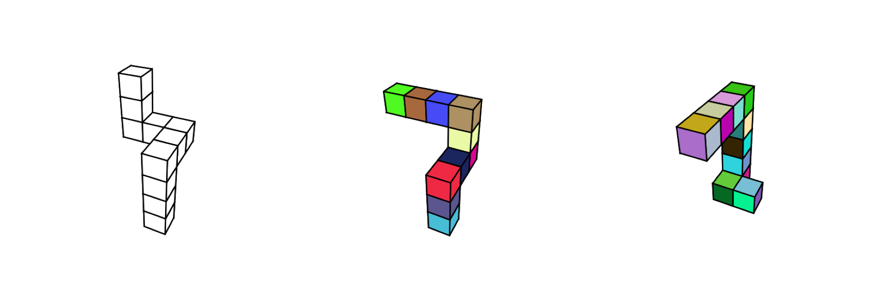

# Shepard and Metzler 3D Shape Renderer

The Shepard and Metzler 3D Shape Renderer is a custom-developed image rendering tool for generating perspective pictures of three-dimensional abstract objects from the study on mental rotation done by [Shepard R.N. & Metzler J.(1971)](https://www.science.org/doi/10.1126/science.171.3972.701).

<div align="center">
  
</div>

## Installation

You can install the Shepard and Metzler 3D Shape Renderer from [PyPI](https://pypi.org/project/shepard-metzler-shape-renderer/):

```console
$ python -m pip install shepard-metzler-shape-renderer
```

The package is supported on Python 3.12 and above.

## How to use

The Shepard and Metzler 3D Shape Renderer is flexible in use. The first thing to be done is to configure the renderer. An example of acceptable configuration format is provided in [config.yaml](./how-to-use/config.yaml).
```
camera:
    distance: 25.
    elevation: -35.
    rotation: 20.


renderer:
    image_size: 256
    background: white
    dpi: 100
    format: png


object:
  facecolor: white
  edgecolor: black
  edgewidth: 0.8
```

The following code snippet contains the necessary steps for rendering an image of 3D shape in perspective and saving it in a file. 
```python 
from shaperenderer.geometry import (
    ShapeGenerator,
    MetzlerShape
)
from shaperenderer.renderer import (
    Camera,
    Renderer,
    Object3D
)

generator = ShapeGenerator(random_state=12345)
shape = MetzlerShape(generator.generate())
object_params = {
    "facecolor": facecolor,
    "edgecolor": edgecolor,
    "edgewidth": edgewidth
}

object3d = Object3D(
    shape=shape,
    **object_params
)

camera = Camera()
camera.setSphericalPosition(
    r=camera_distance,
    theta=camera_elevation,
    phi=camera_rotation
)

renderer = Renderer(
    imgsize=(width, height),
    dpi=dpi,
    bgcolor=background,
    format=saveformat
)
renderer.render(object3d, camera)
renderer.save_figure_to_file(filename)
```